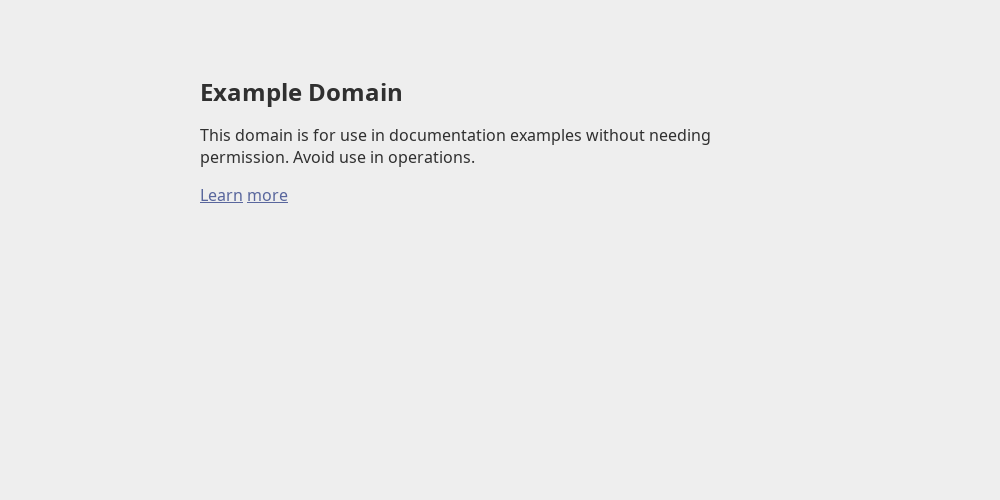

# servo-screenshot

Very simple bash script that takes a screenshot of a website in Servo using the WebDriver API.

Requires `curl` and `jq`.

Example usage:
```sh
./servo-screenshot ~/Downloads/servo/servo/servo https://example.org/ 1000x500
Started Servo with PID 320304
Get WebDiver session ID: 90192a64-7f7a-402b-9f9b-428aacf63a4e
Taking screenshot and storing it at: screenshot.png
Killing Servo with PID 320304
```

Which generates the following screenshot of https://example.org/:


